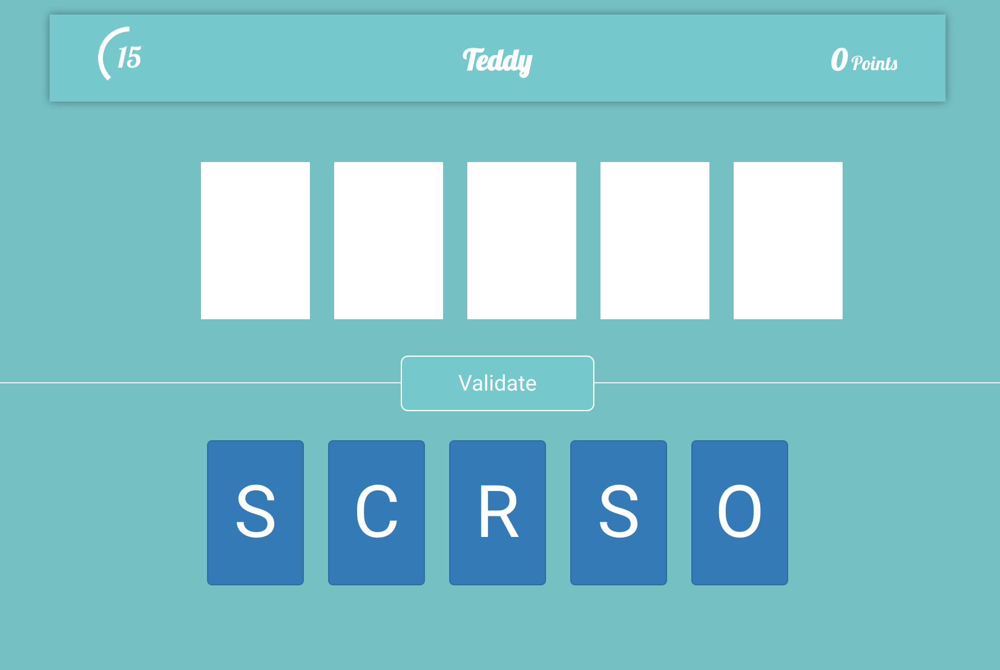

# Find The Word

Find The Word is a small project made with AngularJS 1.X

It is a game where you have to rearrange the most words in 40secs

## Building

To build the project, you will need to get a few dependencies using `bower install` & `npm install`

Then we use grunt as build system:

* `grunt serve` to run the source code on *localhost:9001*
* `grunt build` to build the project for production
* `grunt test` to run unit tests

